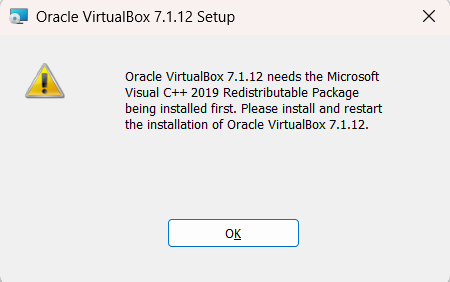

# setup
## vbox
- [virtual box](https://www.virtualbox.org/)

> jika ada error
### 1. need Microsoft Visual C++ 2019


lakukan install ini [c++](https://learn.microsoft.com/en-us/cpp/windows/latest-supported-vc-redist?view=msvc-170)

setelah itu jangan lupa add env variable untuk vboxmanage cli

1. Tekan Win + S → ketik environment variables → pilih Edit the system environment variables.
2. Klik Environment Variables...
3. Di bagian System variables, pilih Path → Edit.
4. Klik New, masukkan: ```C:\Program Files\Oracle\VirtualBox```
5. Tutup PowerShell, buka lagi, lalu coba:
6. test di terminal ```vboxmanage --version```

### vagrant
```bash
scoop install vagrant
vagrant --version
```

> jangan lupa ubah path default vm ya biar enak

1. Buka VirtualBox → File → Preferences → tab General → Default Machine Folder
2. Ganti ke folder tujuan, misalnya D:\VMs
3. Semua VM baru akan disimpan di sana.

# vagrant
## list box
- [vagrant_box_list](https://portal.cloud.hashicorp.com/vagrant/discover)

## list command
### Dasar
```bash
vagrant init <box>          # bikin Vagrantfile untuk box tertentu
vagrant up                  # nyalakan VM (buat dan boot VM kalau belum ada)
vagrant halt                # matikan VM
vagrant destroy             # hapus VM (tapi box-nya tetap ada di cache)
vagrant ssh                 # masuk ke VM via SSH
vagrant status              # cek status VM
vagrant global-status       # lihat semua VM dari semua project
```

### Box Management
```bash
vagrant box list                      # daftar semua box yang sudah di-download
vagrant box add <name> <url/path>      # tambahkan box manual dari file atau URL
vagrant box remove <name>              # hapus box dari cache lokal
vagrant box update                     # update box ke versi terbaru
```

### Provision & Config
```bash
vagrant reload              # restart VM + baca ulang konfigurasi Vagrantfile
vagrant provision           # jalankan ulang provisioning script di VM
```

### Debug / Lainnya
```bash
vagrant plugin list         # lihat plugin Vagrant yang terpasang
vagrant plugin install <p>  # install plugin
vagrant ssh-config          # lihat konfigurasi SSH untuk VM ini
vagrant version             # cek versi Vagrant
```

### snapshoot
```bash
vagrant snapshot save namasnapshot # Buat snapshot
vagrant snapshot list # Lihat daftar snapshot
vagrant snapshot restore namasnapshot # Restore snapshot
vagrant snapshot delete namasnapshot # Hapus snapshot
```
